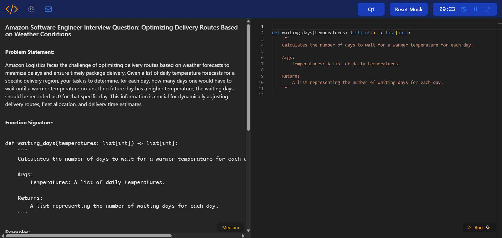

# CodeReal

CodeReal: Interview style company based questions in a timed exam
setup



## What is it?

This is a mock coding interview tool, built by a developer who got tired of solving algorithm problems that felt more like math puzzles than actual interviews.
It takes popular coding questions and reframes them in a way the top tech companies like Amazon, Google, Meta might present them, in realistic, interview-style scenarios.

## Why I built it?

Let's be honest, most interview prep platforms throw problems at you like:

- "Here's a binary tree. Just do something with it."

But in real interviews, you're usually thrown into a scenario like:

- "Our users are reporting inconsistent transaction logs — figure out why."

So I built this as a way to simulate that environment.

## How it works?

1. **Click Start Mock** - You get a company-style question and a timer starts immediately.
2. **Pause if needed** - You can pause the timer if you don't want a timed session.
3. **Time's up** - Once the timer hits 0, your code gets locked. No more edits — just like a real interview.
4. **Test your solution** - Click Run — your solution is copied, and you can paste it directly into LeetCode to test.

At the bottom of each question, you'll find:

- A link to the original LeetCode problem
- A NeetCode solution, if it exists

## Fully customizable

Before you start, you can tweak:

- **Company** (Amazon, Google, Meta, etc.)
- **Difficulty level**
- **Number of questions**
- **Timer settings**
- **Topics** (DP, Graphs, Arrays, etc.)

## 🚀 Live Demo

Try it out: **[code-real.vercel.app](https://code-real.vercel.app)**

## 🛠️ Tech Stack

### Frontend

- **Vite**
- **Vue.js 3**
- **Tailwind CSS**
- **Monaco Editor**
- **Pinia** - State management

### Backend

- **Node.js**
- **Express.js**
- **Google Gemini AI**

### Deployment

- **Vercel**

## 📋 Prerequisites

Before you begin, ensure you have the following installed:

- **Node.js** (version 16 or higher)
- **npm** (comes with Node.js) or **yarn**
- **Vercel CLI** (for deployment)
  ```bash
  npm install -g vercel
  ```

## Development Setup

### Local Development (without Vercel)

1. **API Setup:**

   ```bash
   cd api
   npm install
   npm run dev
   ```

2. **Frontend Setup:**
   ```bash
   cd frontend
   npm install
   npm run dev
   ```

### Vercel Setup

This project is configured for deployment on Vercel with the following setup:

#### Project Structure

- **API**: Backend Node.js/Express server in the `/api` directory
- **Frontend**: Vue.js application in the `/frontend` directory
- **Root**: Contains `vercel.json` for deployment configuration

#### Vercel Configuration

The `vercel.json` file configures:

- API routes to be served from the `/api` directory
- Frontend static files to be served from the `/frontend/dist` directory
- Proper routing for both API and frontend

#### Vercel Commands

1. **`vercel dev`** - Run the entire application locally using Vercel's development environment

   - This simulates the production environment locally
   - Handles both API and frontend routing automatically
   - Useful for testing the complete deployment setup

2. **`vercel --prod`** - Deploy to production

   - Builds and deploys the entire application
   - Automatically handles the build process for both API and frontend
   - Deploys to your production Vercel URL

3. **`vercel`** - Deploy to preview environment
   - Creates a preview deployment for testing
   - Useful for testing changes before going to production

#### Development Workflow

1. **Local Development**: Use `vercel dev` for the most accurate production simulation
2. **Testing**: Use `vercel` for preview deployments
3. **Production**: Use `vercel --prod` for live deployment

#### Environment Variables

Make sure to configure the following environment variables in your Vercel dashboard:

- Any API keys or configuration needed for your backend services
- Database connection strings (if applicable)
- External service credentials

#### Build Process

Vercel automatically:

1. Installs dependencies for both API and frontend
2. Builds the frontend Vue.js application
3. Deploys the API routes
4. Serves static files from the built frontend
